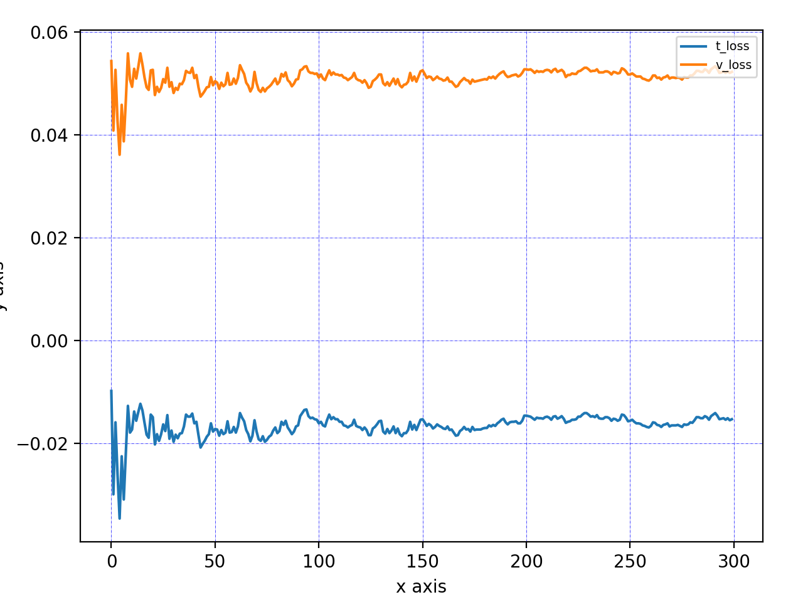
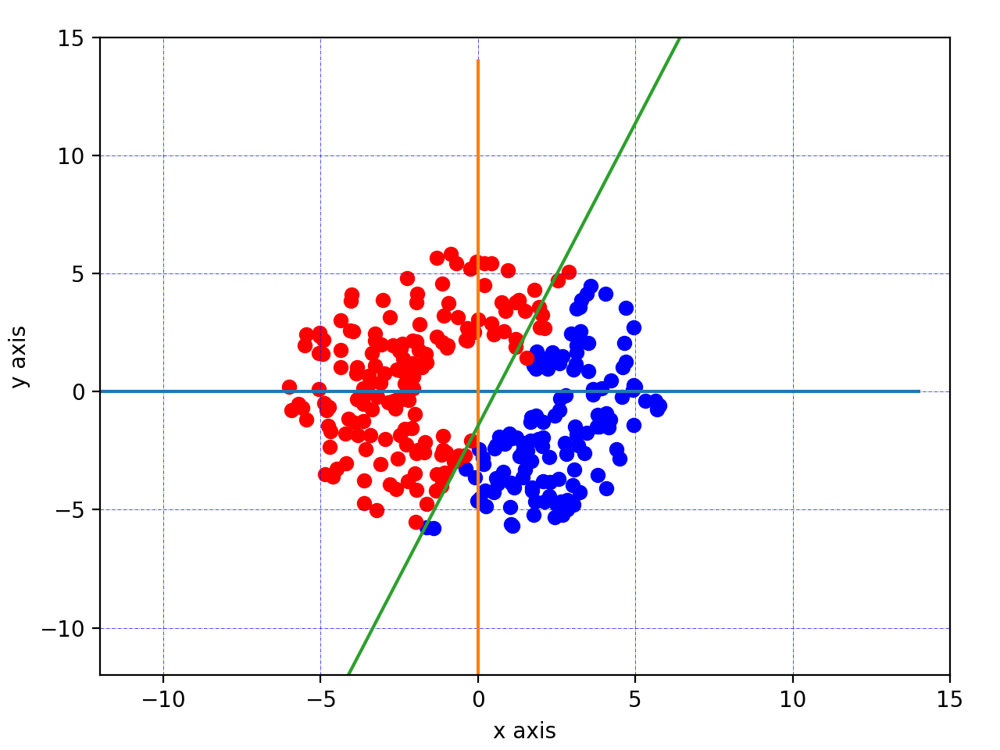

## Perceptron Algorithm

Perceptron algorithm can be used to classify data.   
First, you need to make a model, then use the model to train part of data. Next, you can evaluate the loss and accuracy. If the result is not good, you can train more data or modify the model until it gives good accuracy. Finally, you can predict any data to see which group it belongs to.

### Requirement
```
python==3.7.0
numpy==1.18.1
```

#### Training & Validation losses



#### Evaluation
Loss       = 0.15394  
Accuracy   = 98.0 %  
  

### How to use
Open test.py you will find the example
```
if sys.argv[1] == "train":
    outs = load_data(filename = "./data/data1_4.csv",
                      shuffle = True,
                      split_ratio = 0.6)
    tr_data  = outs[0]
    tr_label = outs[1]
    val_data = outs[2]
    val_label= outs[3]

    history  = model.fit(tr_data,
                         tr_label,  
                         val_data,
                         val_label,
                         epochs    = 300,
                         batch_size= 30)

    loss, acc = model.evaluate(val_data, val_label)

    print("Evaluation, loss =",loss, "acc =",acc,"%")
    model.save_weights("./model/model.txt")

    plot(tr_data,tr_label,history["w"],history["b"],plot_loss = True)

elif sys.argv[1] == "predict":
    w, b = model.load_weights("./model/model.txt")

    x = np.array([float(sys.argv[2]), float(sys.argv[3])])
    y = model.predict(x)
    print("y = ",y)

elif sys.argv[1] == "plot":
    w, b = model.load_weights("./model/model.txt")
    outs = load_data(filename    = "./data/data1_4.csv",
                     shuffle     = True,
                     split_ratio = 0.6)
    val_data  = outs[2]
    val_label = outs[3]
    plot(val_data, val_label, w, b)
```
